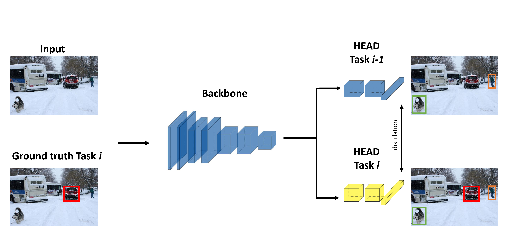
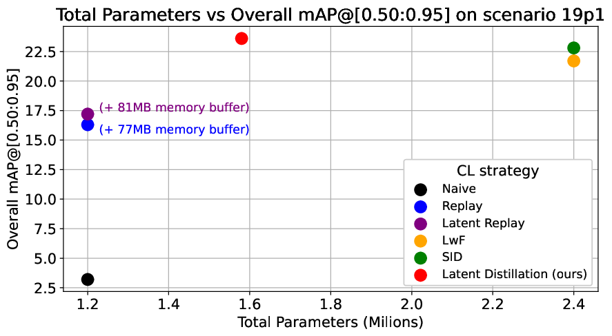

<div align="center">


# Latent Distillation for Continual Learning on Nanodet
**Fast and Computationally efficient Continual Learning for NanoDet anchor-free Object Detection model**

</div>

* ⚡ **Fast CL training**: Teacher 1.2M parameters + Student 398K parameters (with frozen backbone) making training on new CL tasks super fast and efficient
* 🪡 **Microcontroller (MCU) tailored**: The trained model is easlily deployable on MCUs requiring just 1.2 MB (int8 econded weights)

****

# Introduction
<div align="center">

</div>
We propose and implement a new approach for Continual Learning of an Object Detector (CLOD) on the Edge by adressing two issues found in the literature:
- Many CLOD approaches use Distillation or Replay based techniques that are computationally inefficient and require long training times
- The studied edge architecture are still too big and inefficient to run on really constrained edge devices such as an MCU

We adress the first issue by proposing Latent Distillation (LD).
LD, as depicted in the figure above, relies on a frozen copy of the backbone shared between the teacher and the student network. This makes the batch inference as well as the backbropagation on the student network significantly faster during training.

We adress the second issue by implementing our approach on Nanodet-plus a super fast and lightweight anchor-free object detector.
We use Nanodet-plus without the weight-averaging module and the auxiliary heads. This allows us to have a teacher network of 1.2M parameters and a student network with only 399K to train (considering a full frozen backbone).

For more details, please refer to our [paper](#citation)

## Benchmarks
<div align="center">
<p float="left">
  
   
</p>
</div>
We benhmarked Latent Distillation on VOC2007 CL scenarios.
A task dataset is created by selecting from the train-val split all the images containing at least one annotation corresponding to the classes defined in the .cfg file.

The figure in the left depicts the overall mAP performances in a series of CL tasks with respect to other CL techniques.
The figure in the right depicts the memory requirement vs the mAP that our method requires agains others. (In Replay we don't consider the computational inefficiency given by having to train on the additional memory buffer).

****
# CL Training

## Install Nanodet
As our work is based on the Nanodet detector, you need to first install it in an environment. 
To do so, refer to [nanodetDocs/README.md](nanodetDocs/README.md)

## Setup Config file

Before training you need to setup the training cfg file!

To do so:
- Open [cfg/VOC.yml](eclod/cfg/VOC.yml)
- Edit img_path and ann_path of train and val data to the path of your train and test datasets
- If you have a GPU, edit device to the parameters that work best for your specific machine 
- If you want, you can change in schedule the epochs, val intervals as well as optimizer and learning rates 

You can change the Nanodet architecture by taking inspiration from other configs.
To do so please refer to [nanodetDocs/README.md](nanodetDocs/README.md) and update the cfg file based on your needs.

### Remarks

For now, CL scenarios are created correctly for xml datasets such as VOC.
COCO support coming soon!

## Continual Trainining
We define some CL scenarios to train the model:
- **15p5** : The model is trained on the first 15 classes of VOC at task 0, on the subsequent 5 at task 1
- **10p10** : The model is trained on the first 10 classes of VOC at task 0, on the subsequent 10 at task 1
- **19p1** : The model is trained on the first 15 classes of VOC at task 0, on the remaining 1 at task 1
- **15p1** : The model is trained on the first 15 classes of VOC at task 0, on the remaining classes, 1 class at a time for the 5 subsequent tasks

You can test the scenarios with our method as well as other CL techniques by running (from eclod folder and with the created environment):

**Fine-Tuning Naive**

```python naive.py --task <The CL task e.g. 15p1> --cfg <Path to the initial cfg file e.g. cfg/VOC.yml>```

**Replay**

```python replay.py --task <The CL task e.g. 15p1> --cfg <Path to the initial cfg file e.g. cfg/VOC.yml>```

**LwF**

```python replay.py --task <The CL task e.g. 15p1> --cfg <Path to the initial cfg file e.g. cfg/VOC.yml> --alpha<(Optional)The weight of the distillation loss>```

The LwF implementaion code is in ```\nanodet\trainer\LwF_task.py```

**SID Distillation**

```python SID.py --task <The CL task e.g. 15p1> --cfg <Path to the initial cfg file e.g. cfg/VOC.yml> --alpha<(Optional)The weight of the distillation class loss> --beta<(Optional) The weight of the intermediate distillation loss>```

The SID implementaion code is in ```\nanodet\trainer\dist_task.py```

**Latent Distillation**

```python latentDistillation.py --task <The CL task e.g. 15p1> --cfg <Path to the initial cfg file e.g. cfg/VOC.yml> --alpha<(Optional)The weight of the distillation class loss> --beta<(Optional) The weight of the intermediate distillation loss>```

The Latent Distillation implementaion code is in ```\nanodet\trainer\latent_dist_task.py```

****

## Citation

If you find this project useful in your research, please add a star and cite us 😊 

```BibTeX
@misc{Latent Distillation for Continual Object Detection on the Edge,
    title={},
    author={},
    year={2024}
}
```

****

## Thanks

https://github.com/RangiLyu/nanodet
